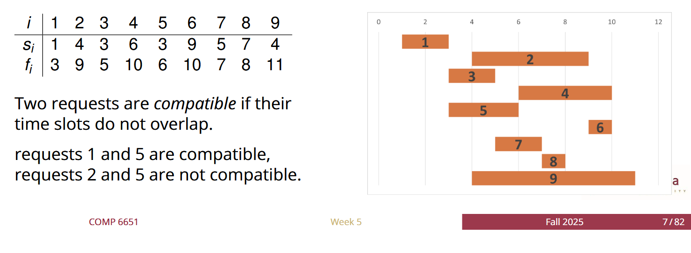
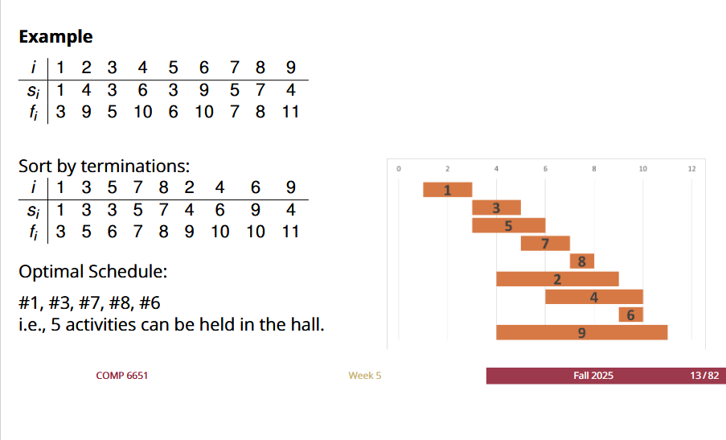

# **Algorithmic Recurrences**
---
- If the question is small enough, T(n) = theta(1). For ex, we have one element in ``Array[]``

# **Greedy Algorithm**
- Greedy Algorithm usually is to Find the optimize Solution such as Find the **Max** or **Min** Solution.
- **Step:** Find the Feasible solution then optimal that feasible solution 
---
## **Activity Selection problem**
- **Definition:** Find the max number of the activity can happen without the overlap in the hall


---
### **Normal Approach**
---
- **Step 1: Normal approach** with an unsorted activity list, lets find the earliest $f_i$ (which refer to the earliest finish time of a activity). **Then,** we set this $f_i$ as our start value saying ``` k = $f_i$``` 

- **Step 2:** Since **the goal** is to Find the Max number of Activity can appear on the hall without Overlapping and we have our first value k which is the earliest finish time of all the activity. **Therefore,** the way to do it is to find the next activity of $S_i$ >= k and compare all the **feasible $S_i$** to find the minimum among it and it is our second activity, then we keep this process until we finished

---

- **Normal approach Conclusion:** Finding the feasible solution and the minimum among them in unsorted Activity List.
- Worst case For finding all the feasible solution which is $(n-1) + (n-2) + .... 1 = n*(n-1)/2$.
- The comparison of min is operated it through the process of finding feasible solutions. Meaning every step of iteration we got **$2(n-1)$ instead of $(n-1)$**. But still it is a Linear cost.
- Therefore this algorithm without using greedy method is **$(n-1) + (n-2) + .... 1 = n*(n-1)/2$.** which is **$O(n^2)$**.

---

### **Greedy Approach**
---

- **Step1:** Sort the activity list base on $f_i$. For ex:
             $i=1: [1,3]$
             $i=3: [3,5]$
             $i=5: [3,6]$
             $i=7: [5,7]$
             $i=8: [7,8]$
             $i=2: [4,9]$
             $i=4: [6,10]$
             $i=6: [9,10]$
             $i=9: [4,11]$
    **Sorted cost is $O(nlogn)$**, then Once we have sorted it, we can write our algorithm below
    ```
    Greedy-Activity-select(s,f,n):
    //s,f are sorted finish and start
    // n is the number of activities
    k  = 1
    A = f_1;
    For i =2 to n do:
      if s_i >= A:
        k += 1
        A = f_i;
    ```
- **Above algorithm actually only tell u how many activity u can max it out but not telling u the exact activity number**

- The cost here is $O(n)$ Since its sorted already so the final cost is **$nlog(n) + n = O(nlog(n))$**. 

---

- **same greedy Algorithm But the result will show Selected activity**
```
Greedy-Activity2(s,f,n)
// s and f is sorted
A = [a1]
k = 1
for i = 2 to n do
  if f_(i) <= s_k
    A.append(ai)
    k = i 
```
---

- **Here is the result**



### **Proof by (exchange argument or Induction)**

#### **Argument Exchange**
---
- **The goal is to prove the greedy method wont lose the optimality.**

- Assume we have an **hypothetical optimal schedule $e'_1,e'_2 ... e'_k:$ with k activity which is the most optimal one**

- assume $e_1 \neq e'_1$, then **Since $e_1$ is the earliest termination.** so when we replace $e_1$ with $e'_1$, $e'_2$ wont overlap with $e_1$. 
- **Therefore**, we can follow this logic and successfully switch $e'_1 ... e'_k$ to $e_1 ... e_k$ without changing the **activity number k**. So we proof even we have a *optimal schedule*, we can replace to **greedy method**, without lose optimality.

#### **Induction**
---
- **base case:** n = 1, k = 1 is the optimal select
---
- **inductive hypothesis**
- 


---

## **Scheduling Problems (Restaurant Menu Greedy Algorithm)**

### **Q2: Restaurant Menu Greedy Algorithm**
---

**Problem Definition:**
- **Given:** n tasks: $(T_1, ..., T_n)$, Processing times: $(P_1, ..., P_n)$, Finish times: $(f_1, ..., f_n)$
- **Constraint:** $f_i < f_j$ (tasks have ordering constraints)
- **Goal:** Find the **earliest completion time for Chef** (minimize completion time, meaning the earliest time for all juniors finish their task)

---

### **Completion Time Formula**
- For task $i$: Completion time = $S + \sum_{k=1}^{i} P_k + f_i$
  - Where $S$ = cumulative time before $T_i$
  - $\sum P_k$ = total processing time up to task $i$
  - $f_i$ = finish time for task $i$

---

### **Greedy Strategy**
- **Decision:** Schedule tasks in **decreasing order of $P_i$** (largest processing time first)
- **Algorithm:**
```
Sch(T, P, f):
  Sort tasks in decreasing order of P_i
  // P₁ = p (largest)
  // P₂ = ...
  // P₃ = b
  // P₄ = 4 (smallest)
  Return T
```

---

### **Proof of Correctness using Argument Exchange**
---

**Goal:** Prove the greedy method gives optimal solution

**Setup:**
- Assume an **optimal schedule** $T_i, T_j$ where $f_i < f_j$ (ordered by finish time constraint)
- Cumulative time before $T_i = S$. Then **Two Cases:**

**Case 1 - Optimal Assume:**
- $T_i = S + P_i + f_i$
- $T_j = S + P_i + P_j + f_j$

**Case 2 - Swap:** $T_i < T_j$: 
- $T_j = S + P_j + f_j$
- $T_i = S + P_j + P_i + f_i$ (Greedy)

**Comparison:**
- If $f_i < f_j \Rightarrow (S + P_i + P_j + f_i) < (S + P_i + P_j + f_j)$

**For optimal:** Assume Max = $T_j$ since $P_i > 0$

**After Swap:** $T_i$ and $T_j$ in Swap are both $< T_j$ in Assume

**Conclusion:** We prove **the optimal can be improved by using Greedy**

---

### **Time Complexity**
- **Sorting:** $O(n \log n)$ since we sort by processing time
- **Overall:** $O(n \log n)$

---
## **Faster Greedy Scheduling Problems using Heap and Priority Queue**
---

### **Faster Greedy Algorithm**
```
Faster-Greedy(S, f, n)
// Sorted by S_i
H = [] // PQ, Room = 0
For i = 1 ... n do
    If H is not empty:
        (E, f_i) = H.peek() // get the min element
        If S_i >= f_e do => H.remove min; H.insert f_i;
        Else: H.insert f_i; R += 1
    Else: H = H.append[i]
```

### **Analysis using Divide and Conquer**
---
- **Recurrence:** $T(n) = T(n/2) + O(n)$
- **Using Master Theorem:** $T(n) = 4T(n/2) + n$
- **Solution:** $T(n) = O(n^2)$ 
- **With Heap optimization:** $T(n) = T(n/2) + n \log n$
- **Final complexity:** $O(n \log^2 n)$

---

## **Set Scheduling Problem**
---

### **Problem Definition**
- **Given:** Set of tasks $S = \{a_1, ..., a_n\}$
- **Schedule Question:** $P_i$ time unit of $a_i$, $C_i$ finish time of $a_i$
- **Example:** $a_1, a_2$ task, $P_1 = 3, P_2 = 6$. Run $a_1$ before $a_2$

### **Greedy Strategy**
- **Sort $P_i$ in increasing order**
- **Algorithm:**
```
Schedule-f(P, n)
T(n) = aT(n/b) + f(n)
```

### **Master Theorem Analysis**
- **Form:** $T(n) = 2T(n/3) + n^2 \lg n$, $a=2, b=3$
- **Case analysis:** $n^{\log_3 2} = n^{0.63}$
- **Since** $n^2 \lg n > n^{0.63}$
- **Result:** $T(n) = O(n^2 \lg n)$

---

# **Amortized Analysis**
---

## **Binary Counter Analysis**
---

### **Aggregate Method - Binary Counter**
- **Operation:** INCREMENT on k-bit binary counter
- **Cost analysis:** Last bit flips every operation, bit 1 flips every 2 operations, etc.
- **Total flips in n operations:** $\sum_{i=0}^{k-1} \lfloor n/2^i \rfloor < n \sum_{i=0}^{\infty} 1/2^i = 2n$
- **Amortized cost:** $O(1)$ per operation

### **Accounting Method**
- **Charge:** 2 credits per INCREMENT
- **Credit allocation:**
  - 1 credit: pay for actual flip from 0 to 1
  - 1 credit: store on the bit for future flip from 1 to 0
- **Invariant:** Every bit with value 1 has 1 stored credit
- **Result:** $O(1)$ amortized cost per operation

---

# **Dynamic Programming**

## **DP vs Greedy - Key Differences**
---
- **Both** Dynamic Programming and Greedy method are for **optimization problems (Max or min)**
- **DP** will use **recurrence formulas** and follow the **(principle of optimality)** → Problem can be solved by taking **sequence of decisions**

---

## **01 Knapsack Problem**

### **Problem Definition**
- **Container with Weight Capacity:** W ∧ Set of n items: $i_1, i_2, ..., i_n$, each with:
  - **Value:** $V_i$
  - **Weight:** $W_i$
- **Goal:** Find Subset of items where `Total W ≤ Cw` ∧ `Max(V)`
- **Solve method:** Dynamic Programming (*this one cannot solve by greedy method*)
- **Note:** DP is for solving **Optimization Problems**. Also said can solve problems in **Sequence of decisions**

---

### **Example Problem**
- **Given:**
  - m ≤ 8, n = 4
  - P = {1, 2, 5, 6} (Prices/Values)
  - W = {2, 3, 4, 5} (Weights)
- **Find:** Max($\sum P_i \cdot X_i$) ∧ $\sum w_i \leq M$, where $X_i \in \{0, 1\}$

---

# **Dynamic Programming**

## **DP vs Greedy - Key Differences**
---
- **Both** Dynamic Programming and Greedy method are for **optimization problems (Max or min)**
- **DP** will use **recurrence formulas** and follow the **(principle of optimality)** → Problem can be solved by taking **sequence of decisions**

---

## **01 Knapsack Problem**

### **Problem Definition**
- **Container with Weight Capacity:** W ∧ Set of n items: $i_1, i_2, ..., i_n$, each with:
  - **Value:** $V_i$
  - **Weight:** $W_i$
- **Goal:** Find Subset of items where `Total W ≤ Cw` ∧ `Max(V)`
- **Solve method:** Dynamic Programming (*this one cannot solve by greedy method*)
- **Note:** DP is for solving **Optimization Problems**. Also said can solve problems in **Sequence of decisions**

---

### **Example Problem**
- **Given:**
  - m ≤ 8, n = 4
  - P = {1, 2, 5, 6} (Prices/Values)
  - W = {2, 3, 4, 5} (Weights)
- **Find:** Max($\sum P_i \cdot X_i$) ∧ $\sum w_i \leq M$, where $X_i \in \{0, 1\}$

---

### **Dynamic Programming Algorithm**

### **DP-01-Knapsack Algorithm**

```
DP-01-Knapsack(W[1...n], P[1...n], W) // W[1...n] = weight for each element
D[0...n, 0...W] = 0  // Create Matrix     // P[1...n] = Price for every element
                                          // W is the capacity
For i = 0 → n do ⇒ D[i, 0] = 0  // Set up 1st Column
For j = 0 → (W-1) do ⇒ D[0, j] = 0  // Set up 1st Row

For i = 1 ... n do  // i ≥ 2
    For j = 1 ... (W) do  // j ≥ 2
        D[i,j] = D[i-1, j]  // P[i] not in
        if w[i] ≤ j:
            D[i,j] = Max(D[i-1, j], D[i-1, j - w[i]] + P[i])
            
Return D[n, W]
```
---

### **DP Table Visualization**

### **Table Structure**
- **Rows (i):** Items (0 to n)
- **Columns (j):** Weight capacity (0 to W)
- **W → Column number**

| i \ W | 0 | 1 | 2 | 3 | 4 | 5 | 6 | 7 | 8 |
|-------|---|---|---|---|---|---|---|---|---|
| 0     | 0 | 0 | 0 | 0 | 0 | 0 | 0 | 0 | 0 |
| P₁ W₁ | 0 |   | 2 | 0 |   |   |   |   |   |
| 1 (2) | 0 |   | 0 |   |   |   |   |   |   |
| 2 (3) | 0 |   | 0 |   |   |   |   |   |   |
| 5 (4) | 0 |   | 0 |   |   |   |   |   |   |
| 6 (5) | 0 |   | 0 |   |   |   |   |   |   |

*i → Row number*

---

## **Decision Making**

### **Sequence of Decisions**
- **Making:** $X_1, X_2, X_3, X_4$

**Interpretation:** 
- Decision variables $X_i \in \{0, 1\}$ indicate whether to include item i
- The optimal solution involves selecting specific items based on the DP table

---

## **Key Concepts**
1. **Cannot solve by Greedy Method** - Requires Dynamic Programming
2. **Optimal Substructure** - Solution to larger problem depends on solutions to subproblems
3. **Memoization** - Store results in DP table to avoid recalculation
4. **Time Complexity:** O(n·W) - Pseudopolynomial time
5. **Space Complexity:** O(n·W) - For the DP table

---

## **Longest Common Subsequence (LCS) Problem**

### **Problem Definition**
---
- **Given:** Two sequences
  - A = {a, b, A, B}
  - B = {a, b, c, d}
- **Goal:** Find the longest common subsequence
- **Method:** Dynamic Programming with recurrence formula

---

### **LCS Algorithm**
```
LCS-DP(X[x₁...xₙ], Y[y₁...yₘ]):
    // Create C Table
    C = C[1, x₁--xₙ, y₁--yₘ]
    
    For i = 0 ... n do ⇒ C[0, i] = 0  // Set the first Row to 0
    For j = 0 ... m do ⇒ C[j, 0] = 0  // Set the first Column to 0
    
    For i = 1 ... n do
        For j = 1 ... m do
            If x[i] == y[j] ⇒ C[i, j] = 1 + C[i-1, j-1]
            Else C[i, j] = Max(C[i-1, j], C[i, j-1])
    
    Return C
```

---

### **LCS Table Example**

| C Table: a | b | d |
|------------|---|---|
| **0** | 0 | 0 | 0 |
| **b** | 0 | 0 | 1 |
| **A** | 0 | 0 | 1 |

---

### **Backtracing Algorithm**
```
Backtracing(C, X, Y):
    i = n; j = m; D = []
    While i > 0 and j > 0:
        If X[i] == Y[j]:
            D.Append(C[i-1, j-1])
            i--; j--;
        Else if C[i-1, j] < C[i, j-1]:
            j--;
        Else:
            i--;
```

**Purpose:** Trace back through the C table to reconstruct the actual LCS sequence

---

### **Key Properties**
- **Optimal Substructure:** LCS(i,j) depends on LCS(i-1, j-1), LCS(i-1, j), and LCS(i, j-1)
- **Overlapping Subproblems:** Same subproblems computed multiple times
- **Time Complexity:** O(m·n) where m, n are lengths of sequences
- **Space Complexity:** O(m·n) for the C table

---